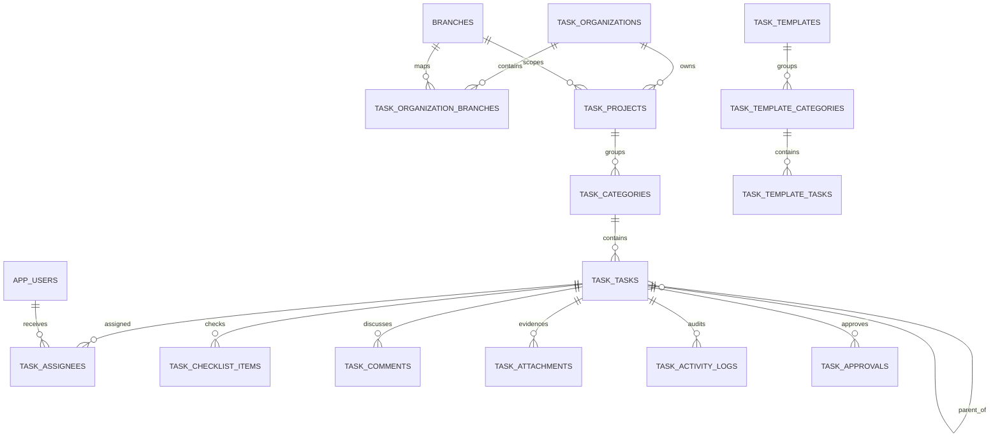

# Task Center V2 Architecture

Task Center V2 mevcut Task Merkezi’nden bağımsızdır. Backend Supabase Auth + PostgreSQL RLS, frontend ise ince bir data-access katmanı kullanır.

## Güven sınırları

- Browser yalnızca publishable/anon key kullanır; service-role key istemciye konmaz.
- Auth zorunludur. Her business kaydı `auth.uid()` üzerinden `app_users` kaydına bağlanır.
- Cross-branch erişim RLS ile engellenir.
- Evidence ve approval geçişleri trigger/RPC seviyesinde korunur.
- Activity log UI’dan update/delete edilemez.
- Project/category/task silme fiziksel delete değil `archived_at` güncellemesidir.
- `create_task_project_from_template` tek transaction içinde proje, kategori ve taskları üretir.
- `update_task_with_version` istemcinin `expected_updated_at` değeri eskiyse `40001` ile reddeder.

## Storage sözleşmesi

- Bucket: `task-evidence` (private)
- Object path: `<project_uuid>/<task_uuid>/<generated-file-name>`
- Metadata önce `task_attachments` tablosuna yazılır; object ve metadata tutarlılığı servis katmanında telafi işlemiyle korunur.
